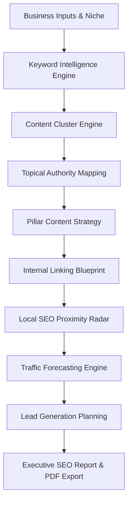

# 🚀 Pillar Architect AI

### AI-Powered SEO Strategy, Content Architecture & Growth Blueprint Platform

<div align="center">
  <br/><br/>
  
  [](https://pillararchitect.vercel.app/)
  [](https://github.com/Anandhu0724/FUTURE_PE_3)
  [](https://github.com/Anandhu0724/FUTURE_PE_3)
</div>

---

> [!IMPORTANT]
> **Future Interns — Prompt Engineering Track: Company Task 3**
> This repository represents **Task 3 of the Prompt Engineering Track for Future Interns**. The project demonstrates advanced LLM system prompting, semantic mapping, schema-driven JSON generation, and multi-model failover mechanisms.

---

## 🌟 Overview

Modern SEO is no longer about publishing isolated blog posts. To outrank competitors, modern digital strategies must establish **Topical Authority** through structured content silos. 

**Pillar Architect AI** is an enterprise-inspired SEO strategy platform that helps businesses, agencies, and marketers build complete SEO growth systems using Artificial Intelligence.

Instead of generating random articles, it maps out complete topical systems:
* **Topical Authority Sitemaps** (Core Pillar Pages & Supporting Clusters)
* **Keyword Intelligence** (Search Intent Categorization & LSI mapping)
* **Local SEO Playbooks** (Hyperlocal targets, schema validation, and GBP optimization)
* **Internal Linking Blueprints** (Silo linking angles and context-aware anchors)
* **SEO Quality Auditor** (EEAT alignment and keyword stuffing checks)

---

## 🔗 Project Links

* **Live Demo URL:** [https://pillararchitect.vercel.app/](https://pillararchitect.vercel.app/)
* **GitHub Repository:** [https://github.com/Anandhu0724/FUTURE_PE_3](https://github.com/Anandhu0724/FUTURE_PE_3)

---

## 📸 Screenshots & Demos

### 🎥 Project Demonstration
* **Demo Video:** [Google Drive Demonstration Link](https://drive.google.com/file/d/1HOfx37h0UuMsjDHjC2RFO5xRX6yRUms7/view?usp=sharing)

### 🖥️ Dashboard & Features Preview

| Local SEO Proximity Radar | SEO CTR Meta Suite |
| :---: | :---: |
|  |  |

---

## ✨ Core Features

### 📊 1. Executive SEO Dashboard
Monitor SEO opportunities through a centralized dashboard. Tracks critical metrics like:
* **SEO Score & Authority Score** benchmarks.
* **Keyword Universe & Traffic Potential** estimations.
* **Lead Potential** and content cluster progress.

### 🧠 2. SEO Blueprint Generator
Generates actionable timelines to kickstart ranking growth:
* **30 / 60 / 90-Day Roadmaps** of high-priority content.
* **Growth Opportunities** & recommended KPIs.

### 🔍 3. Keyword Intelligence Engine
Advanced semantic keyword discovery:
* Maps keywords by **Search Intent** (Informational, Transactional, Navigational).
* Extracts semantic LSI terms and question-based long-tail queries.

### 🏗️ Content Cluster Engine
Structures your site architecture for search engines:
* Groups content into logical **Silos**.
* Establishes clean parent-child relationships between Core Pillars and cluster pages.

### 🌍 Local SEO Playbook
Triggers regional map pack visibility:
* Generates location-optimized landing page briefs.
* Recommends Google Business Profile (GBP) posts and geo-targets.
* Compiles pre-validated **JSON-LD LocalBusiness Schema Markup**.

### 🏛️ SEO Auditor & PDF Reporter
* Audits draft content for **EEAT metrics** and keyword density.
* Exports professional audit reports as a styled **PDF Document**.

---

## 🧩 System Architecture



---

## 💻 Tech Stack & Design Aesthetics

### Frontend
* **Core**: React, TypeScript
* **Styling**: Tailwind CSS for maximum responsiveness
* **Charts**: Recharts, D3.js for local SEO matrix coordinate proximity radar

### Backend (Serverless APIs)
* **Core**: Node.js, Express.js
* **Bundler**: esbuild

### AI Integration
* **API SDK**: `@google/genai`
* **Models**: `gemini-3.5-flash`, `gemini-3.1-flash-lite`
* **Features**: Dynamic JSON Schema generation, system instruction tuning, and progressive model failovers to guarantee 100% uptime.

---

## 📂 Directory Structure

```text
pillar-content-cluster-architect/
│
├── api/                   # Vercel Serverless Function entry point
│   └── index.ts
├── src/                   # React Frontend
│   ├── assets/
│   ├── components/        # Interactive SEO modules (radar, chart, auditor)
│   ├── App.tsx            # Main layout and API managers
│   ├── main.tsx
│   ├── index.css          # Core design system and dark-mode overrides
│   └── types.ts
│
├── .env.example           # Local environment variables example
├── .gitignore
├── README.md              # Project documentation
├── package.json
├── server.ts              # Express Backend Server (runs locally or wraps in Vercel)
├── tsconfig.json
└── vite.config.ts
```

---

## 🚀 Getting Started

### 1. Clone & Install
```bash
# Clone the repository
git clone https://github.com/Anandhu0724/FUTURE_PE_3.git

# Navigate into the project folder
cd FUTURE_PE_3

# Install dependencies
npm install
```

### 2. Configure Environment Variables
Create a `.env` file in the root directory:
```env
GEMINI_API_KEY="your-google-gemini-api-key"
APP_URL="http://localhost:3000"
```

### 3. Run Locally
```bash
# Run both the Express API server and Vite frontend
npm run dev
```
Open [http://localhost:3000](http://localhost:3000) in your browser.

---

## ☁️ Vercel Deployment

This project is configured to run out-of-the-box as a Vercel Serverless Function.

### Environment Variable Setup
Before deploying, ensure you configure your Gemini credentials in the Vercel Dashboard:
1. Navigate to **Vercel Settings** > **Environment Variables**.
2. Add a new variable:
   * **Key**: `GEMINI_API_KEY`
   * **Value**: *[Your Google Gemini API Key]*
3. Deploy the project using Vercel Git Integration or the Vercel CLI:
   ```bash
   npx vercel --prod
   ```

---

## 📄 License

This project is intended for educational, portfolio, and research purposes.

---

## 👨‍💻 Author

**Anandhu**
*Engineering Student | AI Enthusiast | Full Stack Developer*

* **GitHub:** [@Anandhu0724](https://github.com/Anandhu0724)
* **LinkedIn:** [Anandhu's Profile](https://www.linkedin.com/in/anandhu0724/)

---
*⭐ If you found this project helpful, feel free to give it a star!*
